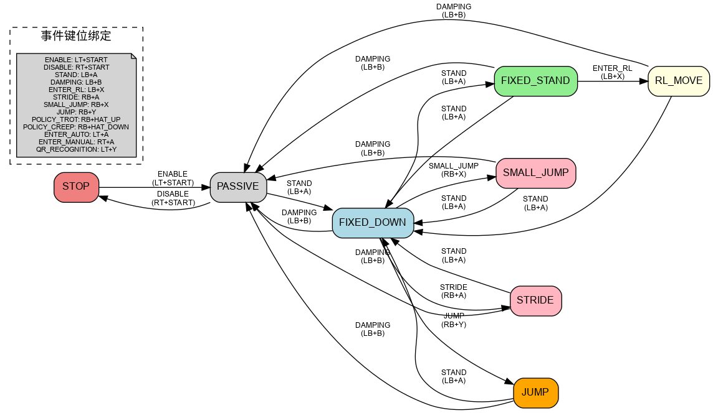
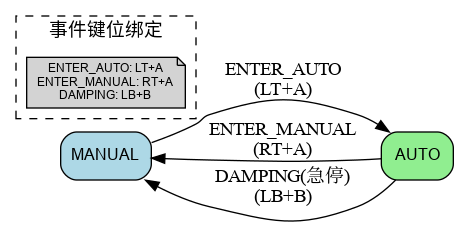
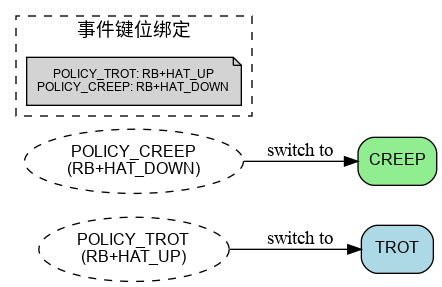

# 四足部署代码

## Quick Start

### 运行

#### 仿真模式

1. 在鲁班猫上运行:

```bash
colcon build
source install/setup.bash
ros2 launch quad simulate.launch.py
```

2. 同时在本机上运行Mujoco仿真节点

仿真参数在`src/config/quad_simulate_cfg.yaml`中修改

#### 实机模式

在鲁班猫上运行:

```bash
colcon build
source install/setup.bash
ros2 launch quad quad.launch.py
```

实机参数在`src/config/quad_run_cfg.yaml`中修改

#### 手柄键位操作

- 状态机转换图及事件对应键位


- 在`RL_MOVE`状态下可以切换**自动/手动控制模式** 和 选择**强化学习策略**


