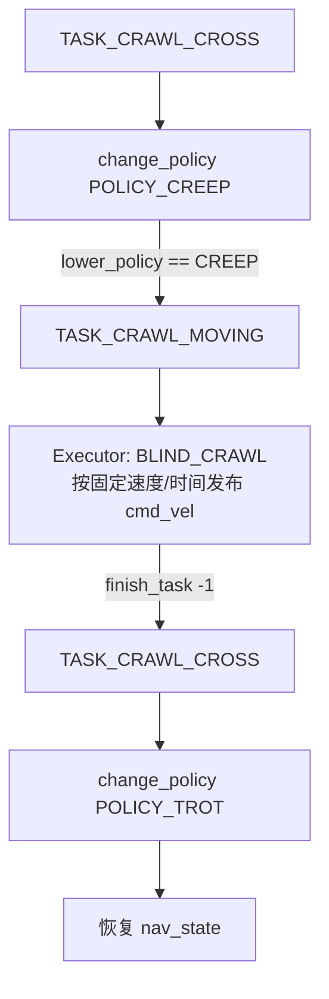
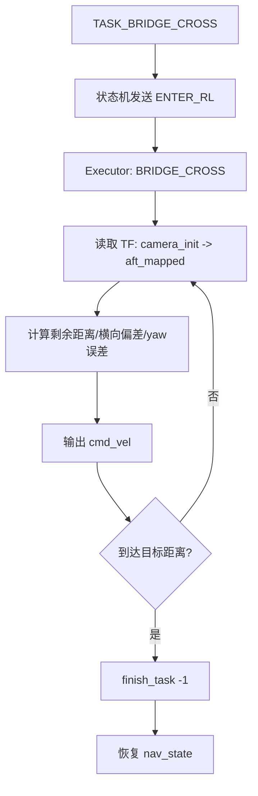
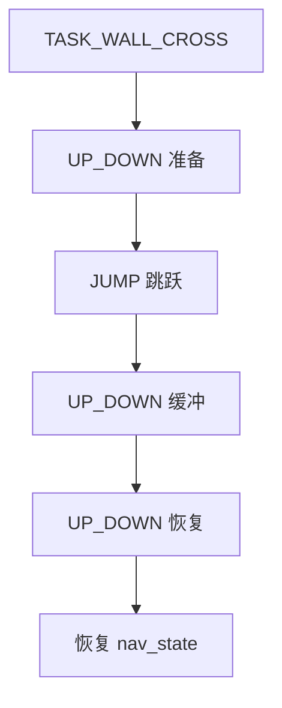
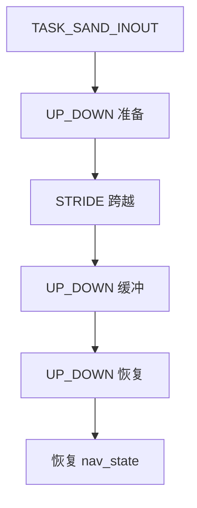
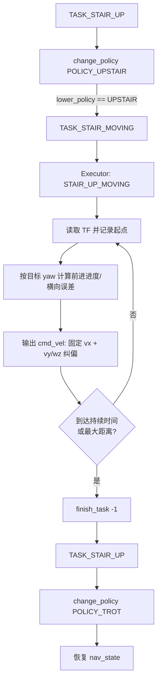
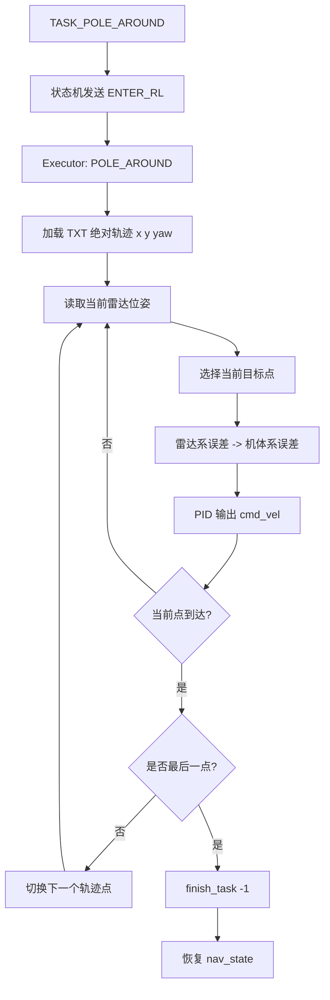
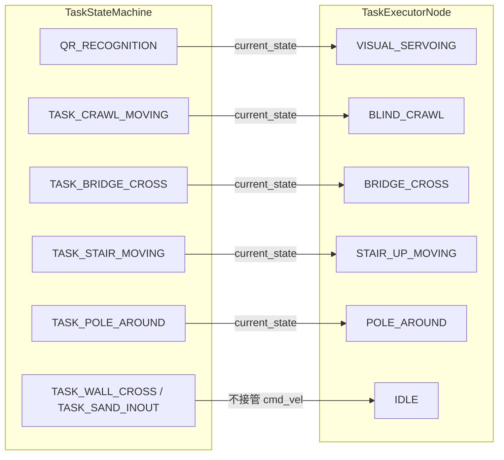

# 状态机与任务转换图

本文档用 Mermaid 绘制 `task_manager` 当前工程中的状态机与任务转换关系。

## 1. 总体状态机

```mermaid
stateDiagram-v2
    [*] --> IDLE

    IDLE --> AUTO_NAV: task_state_command / CMD_AUTO_NAV
    IDLE --> MANUAL_NAV: task_state_command / CMD_MANUAL_NAV
    IDLE --> QR_RECOGNITION: task_state_command / CMD_QR_RECOGNITION

    AUTO_NAV --> IDLE: task_state_command / CMD_IDLE
    MANUAL_NAV --> IDLE: task_state_command / CMD_IDLE
    QR_RECOGNITION --> IDLE: task_state_command / CMD_IDLE

    AUTO_NAV --> QR_RECOGNITION: nav_status == true
    MANUAL_NAV --> QR_RECOGNITION: task_state_command / CMD_QR_RECOGNITION

    QR_RECOGNITION --> TASK_CRAWL_CROSS: task_done(1)
    QR_RECOGNITION --> TASK_BRIDGE_CROSS: task_done(2)
    QR_RECOGNITION --> TASK_WALL_CROSS: task_done(3)
    QR_RECOGNITION --> TASK_SAND_INOUT: task_done(4)
    QR_RECOGNITION --> TASK_CRAWL_CROSS: task_done(5)
    QR_RECOGNITION --> TASK_POLE_AROUND: task_done(6)
    QR_RECOGNITION --> TASK_OTHER: task_done(unknown id)

    TASK_BRIDGE_CROSS --> AUTO_NAV: task_done(-1) / restore nav_state
    TASK_BRIDGE_CROSS --> MANUAL_NAV: task_done(-1) / restore nav_state

    TASK_WALL_CROSS --> AUTO_NAV: execute_complex_task done / restore nav_state
    TASK_WALL_CROSS --> MANUAL_NAV: execute_complex_task done / restore nav_state

    TASK_SAND_INOUT --> AUTO_NAV: execute_complex_task done / restore nav_state
    TASK_SAND_INOUT --> MANUAL_NAV: execute_complex_task done / restore nav_state

    TASK_POLE_AROUND --> AUTO_NAV: task_done(-1) / restore nav_state
    TASK_POLE_AROUND --> MANUAL_NAV: task_done(-1) / restore nav_state

    TASK_OTHER --> AUTO_NAV: task_done(-1) / restore nav_state
    TASK_OTHER --> MANUAL_NAV: task_done(-1) / restore nav_state

    TASK_CRAWL_CROSS --> TASK_CRAWL_MOVING: POLICY_CREEP ready
    TASK_CRAWL_MOVING --> TASK_CRAWL_CROSS: task_done(-1)
    TASK_CRAWL_CROSS --> AUTO_NAV: POLICY_TROT ready / restore nav_state
    TASK_CRAWL_CROSS --> MANUAL_NAV: POLICY_TROT ready / restore nav_state

    TASK_STAIR_UP --> TASK_STAIR_MOVING: POLICY_UPSTAIR ready
    TASK_STAIR_MOVING --> TASK_STAIR_UP: task_done(-1)
    TASK_STAIR_UP --> AUTO_NAV: POLICY_TROT ready / restore nav_state
    TASK_STAIR_UP --> MANUAL_NAV: POLICY_TROT ready / restore nav_state
```



说明：

- `nav_state` 记录进入任务前的导航状态，通常是 `AUTO_NAV` 或 `MANUAL_NAV`。
- `task_done(id > 0)` 表示视觉伺服识别并对准了二维码，`id` 是任务类型。
- `task_done(-1)` 表示具体任务执行完成。
- `CMD_IDLE / CMD_AUTO_NAV / CMD_MANUAL_NAV / CMD_QR_RECOGNITION` 来自 `task_state_command`。

---

## 2. 任务识别与分派

```mermaid
flowchart TD
    A[AUTO_NAV 自动导航] -->|nav_status == true| B[QR_RECOGNITION 二维码视觉伺服]
    M[MANUAL_NAV 手动导航] -->|CMD_QR_RECOGNITION| B

    B --> C{视觉对准成功<br/>finish_task(task_id)}

    C -->|1| T1[矮杆 TASK_CRAWL_CROSS]
    C -->|2| T2[木桥 TASK_BRIDGE_CROSS]
    C -->|3| T3[高墙 TASK_WALL_CROSS]
    C -->|4| T4[沙坑 TASK_SAND_INOUT]
    C -->|5| T5[矮杆 TASK_CRAWL_CROSS]
    C -->|6| T6[绕杆 TASK_POLE_AROUND]
    C -->|其他| TO[TASK_OTHER]

    T1 --> R[恢复 nav_state]
    T2 --> R
    T3 --> R
    T4 --> R
    T5 --> R
    T6 --> R
    TO --> R

    R --> A
    R --> M
```

---

## 3. 各任务内部流程

### 3.1 矮杆任务：步态切换 + 盲走



### 3.2 木桥任务：雷达直线闭环



### 3.3 高墙任务：固定动作序列



### 3.4 沙坑任务：固定动作序列



### 3.5 上楼梯任务：步态切换 + 雷达直线 PID



### 3.6 绕杆任务：雷达绝对轨迹逐点跟踪



---

## 4. 状态机与执行器的对应关系



要点：

- 状态机通过 `current_state` 唤醒执行器不同模式。
- 执行器完成任务后通过 `task_done` 通知状态机。
- 高墙和沙坑是纯状态机动作序列，执行器保持 `IDLE`。
